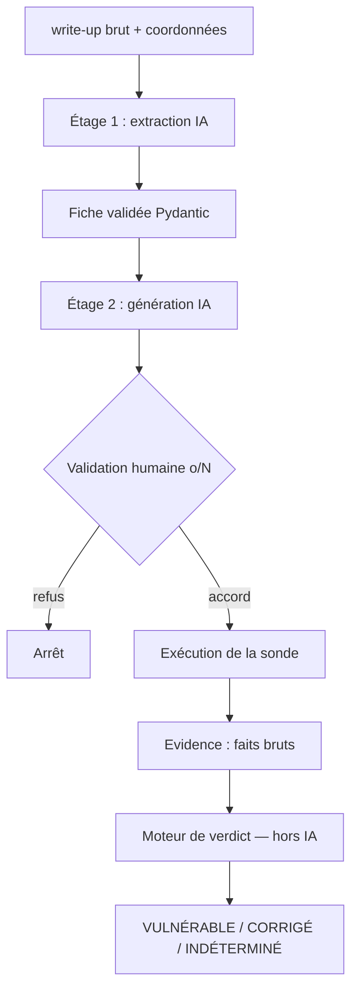

# Mirage

Revérification automatisée de vulnérabilités web après correction, en boîte
noire (sans accès au code source). À partir d'un write-up brut décrivant une
vulnérabilité, des agents IA génèrent un script de revérification qui rejoue le
contrôle sur la cible et rend un verdict : **VULNÉRABLE**, **CORRIGÉ** ou
**INDÉTERMINÉ**.

## Le problème

Après un audit, un client corrige (ou croit corriger) les failles remontées.
Il faut ensuite revérifier chacune : la faille est-elle réellement fermée ?
Aujourd'hui ce travail est manuel — on ressort le rapport, on retrouve le
payload, on le rejoue à la main. Mirage automatise cette étape. Il ne s'agit
pas de *découvrir* des vulnérabilités (le diagnostic, qui reste le travail d'un
pentester), mais de **rejouer un contrôle connu** décrit dans une fiche.

## Architecture



Mirage repose sur une séparation stricte entre ce que fait l'IA et ce qui reste
déterministe :

- **Étage 1 — extraction.** Un agent lit le write-up brut et en extrait
  une fiche structurée : payload, marqueur de succès, description. Les
  coordonnées techniques que le write-up ne contient pas (URL du module,
  paramètre HTTP) sont fournies en ligne de commande et priment sur toute
  valeur devinée par l'IA. La fiche est validée par un modèle Pydantic avant
  d'être utilisée.
- **Étage 2 — génération de la sonde.** Un second agent transforme la fiche en
  une fonction Python `probe` qui rejoue l'exploit. Aucun script d'exploitation
  n'est codé en dur : tout part de la fiche.
- **Moteur de verdict — déterministe, hors IA.** La sonde ne collecte que des
  faits bruts (un objet `Evidence` : cible vivante ?, marqueur présent ?,
  erreur ?). Le verdict est calculé séparément par une fonction fixe, jamais
  par l'IA.

**La règle du faux-corrigé.** Le pire échec d'un outil de revérification est de
déclarer « corrigé » une faille encore ouverte. Mirage l'évite par deux
mécanismes : la sonde teste d'abord la *vivacité* de la cible indépendamment de
l'exploit (contrôle aujourd'hui basique, voir Limites), et le moteur de verdict 
refuse de conclure « corrigé » sur toute erreur, timeout ou absence de 
réponse — ces cas donnent INDÉTERMINÉ. Une cible éteinte n'est jamais confondue 
avec une cible corrigée.

**Validation humaine avant exécution.** Le code de la sonde étant généré par
l'IA, il est affiché et soumis à confirmation (`[o/N]`) avant d'être exécuté.
Mirage n'exécute jamais de code généré sans relecture — un garde-fou
human-in-the-loop face au risque de l'exécution dynamique.

**Stabilité au rejeu.** La sonde, générée une seule fois, est rejouée N fois.
Si le verdict diverge entre rejeux, il est signalé INSTABLE — un indicateur de
confiance qui détecte une cible intermittente ou un réseau instable, sans
refaire d'appel IA.

## Lancer la démo

Prérequis : DVWA lancé et une clé API Anthropic.

```bash
# Banc de test
docker run --rm -d -p 4280:80 vulnerables/web-dvwa
# puis dans le navigateur : Create/Reset Database

# Dépendances
pip install -r requirements.txt

# Clé API
export ANTHROPIC_API_KEY=sk-...

# Revérification (exemple : XSS réfléchie)
python3 main.py writeups/writeup_xss.txt \
    --base-url http://localhost:4280 \
    --actif /vulnerabilities/xss_r/ \
    --param name \
    --security low \
    --show-fiche
```

Les trois verdicts se démontrent en changeant `--security` : `low` →
VULNÉRABLE, `impossible` → CORRIGÉ ; en arrêtant le conteneur → INDÉTERMINÉ.

## Limites et pistes

- **Isolation de l'exécution :** La sonde générée est chargée via exec() : seuls 
  requests et Evidence sont pré-injectés, mais l'exécution n'est pas isolée. 
  La validation humaine ([o/N]) reste le seul garde-fou ; une vraie isolation 
  passerait par un subprocess ou un conteneur jetable dédié.
- **Niveau de délégation à l'IA :** Le choix retenu pour l'architecture est 
  d'exécuter une fonction probe générée par IA pour réaliser le retest, avec
  comme idée de réaliser des tests sur des failles multi-étapes. Pour les 
  failles testées dans ce POC, une fonction probe fixe argumentée par IA aurait
  pu suffire et poserait moins de problématiques sur l'exécution du code.
- **Liveness permissive :** La liveness de la cible est aujourd'hui testée
  par la sonde générée par l'IA, ce qui peut être sujet à une erreur lors de la
  génération du code. Une amélioration serait d'avoir une fonction dédiée, et 
  serait l'une des premières mises à jour à faire sur cet outil.
- **La stabilité mesure le réseau :** Dans cet outil, la sonde est générée une
  fois pour limiter les appels API pour ensuite être rejouée N fois. Une vraie 
  mesure de stabilité régénérerait fiche et sonde à chaque itération, au prix de 
  N appels IA.
- **Vulnérabilités hors du modèle « un GET, un marqueur » :** Les failles
  multi-étapes (ex. SQLi « high » de DVWA, où la valeur transite par la session
  et non par l'URL), les injections aveugles (blind, à détecter par
  différentiel temporel) et les XSS stockées ne sont pas couvertes par la sonde
  actuelle. Ce sont les cas où l'agent devrait générer une sonde plus élaborée.
- **Choix du marqueur.** Il est laissé à l'IA et peut être trop générique. Un
  bon marqueur de revérification est discriminant (une chaîne témoin qu'on ne
  verrait jamais sans exploitation réussie).
- **Cohérence write-up / coordonnées :** Si les coordonnées fournies
  contredisent le write-up, la fiche peut être incohérente. Une vérification de
  cohérence serait une amélioration.
- **Découpage :** Le code est segmenté en modules (evidence, verdict, auth,
  agent, main). On pourrait pousser plus loin la séparation (ex. isoler les
  prompts, le modèle Fiche dans son propre fichier) et éventuellement renommer
  les fichiers de tests.
- **Automatisation en batch :** La validation humaine convient à un usage
  interactif ; pour revérifier de nombreuses vulnérabilités en série, elle
  deviendrait un flag optionnel, complété par l'isolation en conteneur.

